<p align="center">
  
</p>

<h1 align="center">🛡️ MAIL SENTINEL</h1>

<p align="center">
  <a href="https://git.io/typing-svg"></a>
</p>

<p align="center">
  <b>Detect the Threat. Protect the Inbox.</b><br>
  <i>An air-gapped, explainable email phishing triage and threat intelligence workstation engineered for Security Operations Centers (SOC), incident responders, and privacy-first enterprises.</i>
</p>

<p align="center">
  <a href="#quick-start"></a>
  <a href="#zero-egress"></a>
  <a href="https://fastapi.tiangolo.com"></a>
  <a href="https://react.dev"></a>
  <a href="https://python.org"></a>
  <a href="#ml-performance"></a>
  <a href="#interface-showcase"></a>
  <a href="LICENSE"></a>
</p>

---

<!-- Live Animated Threat Radar & Activity Ring Gauge -->
<p align="center">
  
</p>

## 🌟 Executive Overview

**Mail Sentinel** provides immediate, explainable email phishing risk assessments by synthesizing **local statistical NLP (Naive Bayes / TF-IDF)** with **deterministic heuristic inspection algorithms**.

Designed with an **Apple-inspired macOS & visionOS frosted dark design language**, analysts experience a distraction-free, high-fidelity console with **Apple Watch Activity Ring risk scoring**, granular forensic explainability, and actionable SOC remediation playbooks.

### 🛡️ Why Mail Sentinel?
- 🔒 **Zero Cloud Egress**: 100% confidential. No email body, credentials, or attachments leave your machine.
- ⚡ **Sub-Second Multi-Engine Triage**: Ingests raw RFC 5322 headers, body text, or `.eml` files instantly.
- 🧠 **Explainable Intelligence**: Every risk score points to exact regex matches, header hops, and NLP token weights.
- ✨ **Apple-Grade Aesthetic**: Obsidian dark mode, fluid glassmorphism, responsive stationary sidebar, and built-in interactive onboarding guide.

<!-- Main SOC Console High-Resolution Hero Preview -->
<p align="center">
  <a href="./docs/screenshots/01_soc_dashboard.png">
    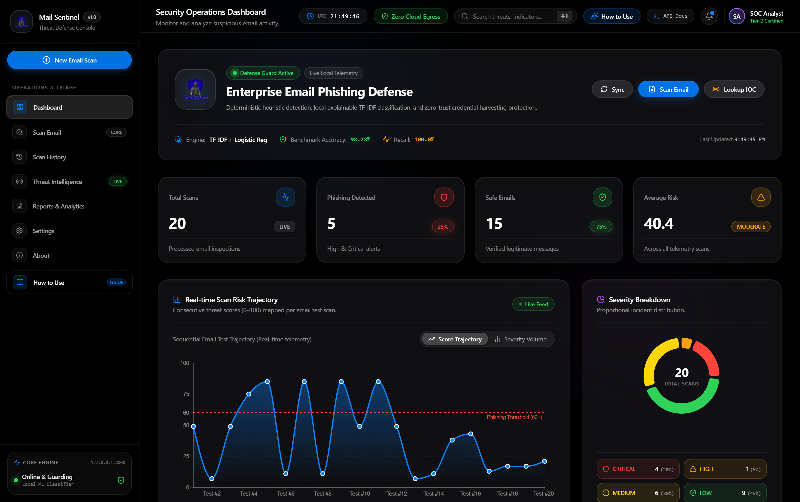
  </a>
</p>

---

<h2 id="pipeline-flow">🚀 Live Detection Pipeline Flow</h2>

<!-- Live Animated Detection Pipeline Flowchart with moving packets -->
<p align="center">
  
</p>

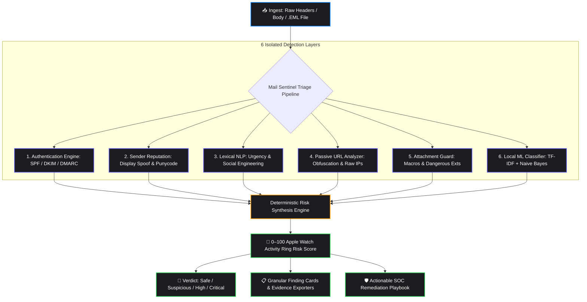

---

## 💻 Live Animated SOC Terminal Demonstration

<!-- Live Animated SOC Terminal Demonstration -->
<p align="center">
  
</p>

---

<h2 id="design-system">🎨 Apple-Inspired Design System</h2>

Mail Sentinel incorporates the best elements of Apple's modern Human Interface Guidelines:

- **Deep Obsidian Surfaces**: `#000000` base with multi-layered frosted glass (`backdrop-filter: blur(28px) saturate(190%)`).
- **Specular Edge Highlights**: Hairline top reflection (`inset 0 1px 0 rgba(255, 255, 255, 0.1)`) matching macOS Tahoe and visionOS window materials.
- **Apple Watch Activity Ring Gauge**: Dynamic circular radial progress visualization with color-graded status verdicts.
- **Stationary Pinned Sidebar**: Desktop-grade fixed navigation that remains 100% stationary during page scrolling.
- **Interactive Startup Onboarding Guide**: Integrated macOS modal dialog with a 4-step tour, feature directory, and pro tips.

---

<h2 id="interface-showcase">📸 Application Interface & Forensic Workstation</h2>

<p align="center">
  <i>Explore the Mail Sentinel interface, engineered to Apple Human Interface Guidelines with dark frosted glassmorphism. Click any screen to view in full Retina resolution.</i>
</p>

| 🖥️ SOC Operations Command (`/`) | 🔍 Email Security Scanner (`/scan`) |
| :---: | :---: |
| [](./docs/screenshots/01_soc_dashboard.png) | [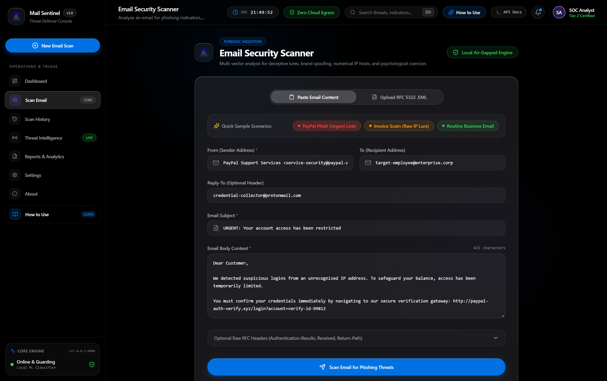](./docs/screenshots/02_security_scanner.png) |
| *Real-time incident ingestion telemetry, threat score trajectory, and 6-engine status gauges.* | *Dual-mode ingestion supporting raw RFC 5322 headers and .eml drag-and-drop.* |
| **🎯 Forensic Threat Dossier (`/results/:id`)** | **🌐 Threat Intelligence Workstation (`/threat-intelligence`)** |
| [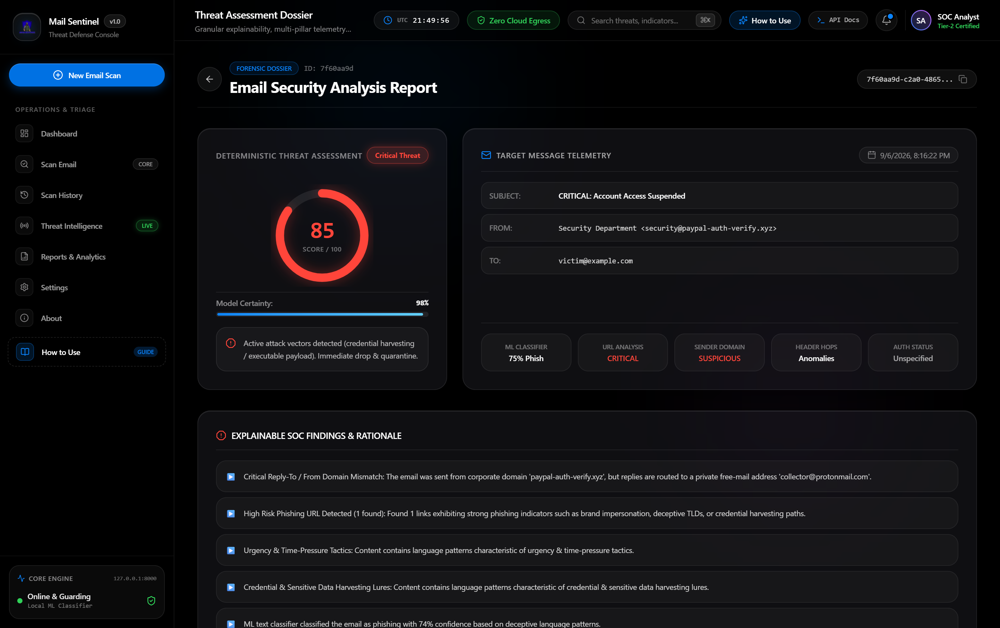](./docs/screenshots/03_threat_dossier.png) | [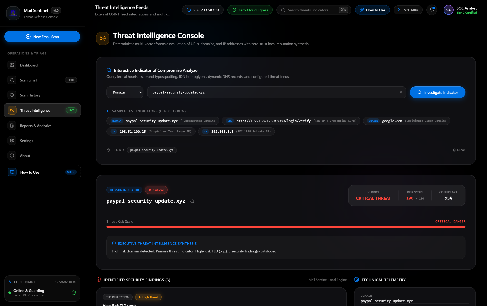](./docs/screenshots/04_threat_intelligence.png) |
| *Apple Watch Activity Ring risk scoring (85/100 Critical), regex evidence, and SOC playbook.* | *Real-time IOC lookup console with multi-feed OSINT integrations and passive scoring.* |
| **📜 Scan History & Incident Log (`/history`)** | **📊 Security Reports & Analytics (`/reports`)** |
| [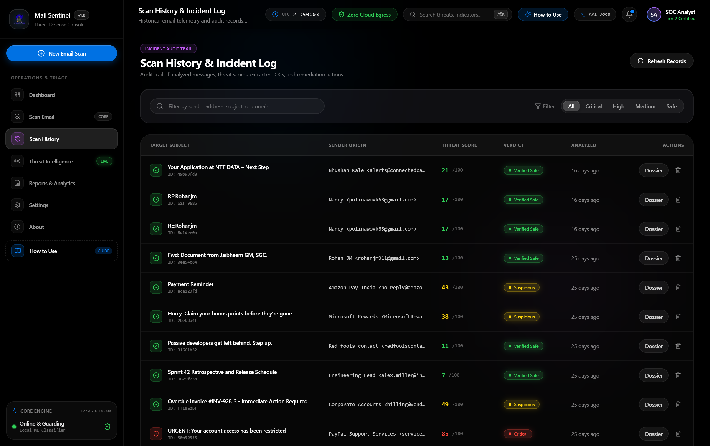](./docs/screenshots/05_incident_history.png) | [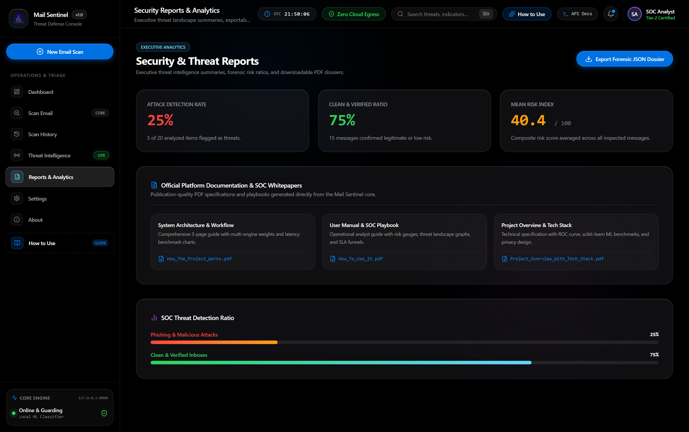](./docs/screenshots/06_security_reports.png) |
| *Searchable chronological audit log with multi-severity filter pills.* | *Executive posture analytics, attack vector distribution breakdown, and exports.* |
| **⚙️ Platform Configuration (`/settings`)** | **💡 Interactive Onboarding Tour (`Modal`)** |
| [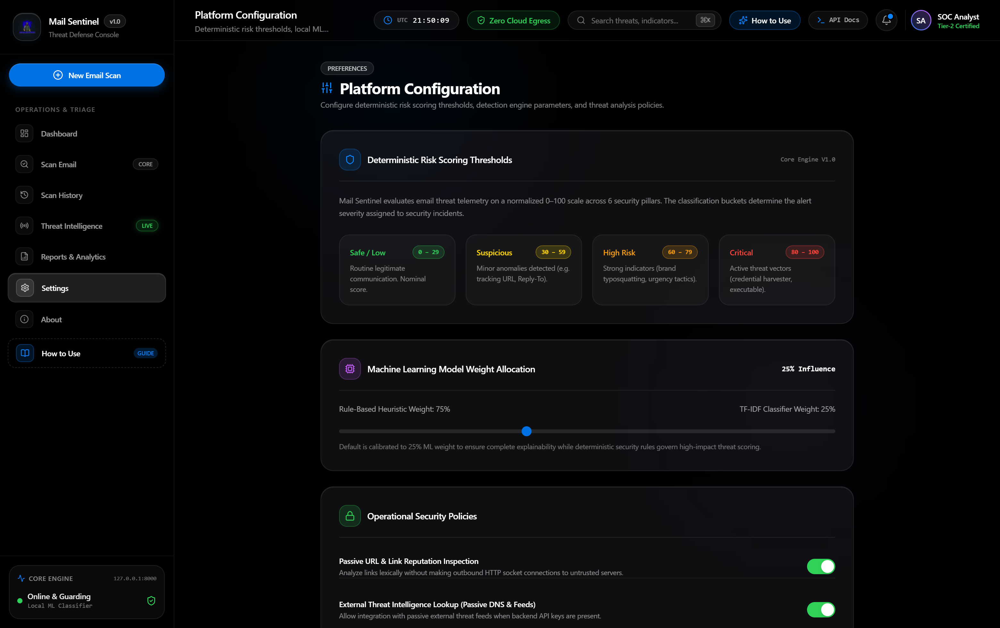](./docs/screenshots/07_platform_settings.png) | [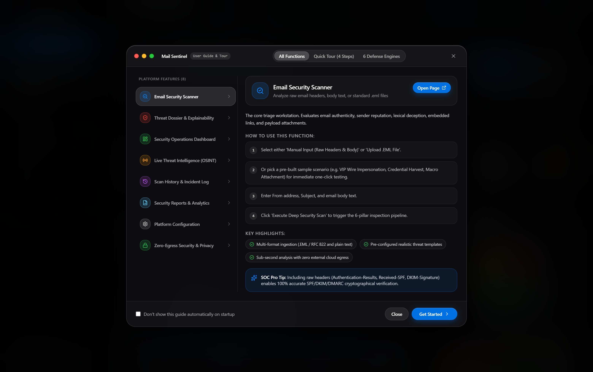](./docs/screenshots/08_onboarding_guide.png) |
| *Tunable ML model influence sliders, threshold definitions, and privacy switches.* | *Integrated macOS modal dialog welcoming analysts with a 4-step interactive walkthrough.* |

---

<h2 id="platform-features">🧩 Platform Features & Capabilities</h2>

<details open>
<summary><b>1. Email Security Scanner (<code>/scan</code>)</b></summary>

- **Dual Ingestion**: Paste raw email headers/body text, or drag-and-drop `.eml` files.
- **Pre-Loaded Threat Scenarios**: One-click testing with realistic phishing templates:
  - 🚨 *VIP Impersonation / CEO Wire Fraud* (Display name spoofing, high urgency)
  - 🎣 *Credential Harvester* (Urgent password expiration lure with obfuscated IP link)
  - 📎 *Malicious Invoice* (Macro attachment signature with fake billing details)
  - 🛡️ *Legitimate Security Bulletin* (Clean, passing SPF/DKIM authentication)

<p align="center">
  <a href="./docs/screenshots/02_security_scanner.png">
    
  </a>
</p>

</details>

<details>
<summary><b>2. Threat Assessment Dossier (<code>/results/:id</code>)</b></summary>

- **Activity Ring Verdict**: 0–100 risk score categorized into `SAFE` (0–29), `SUSPICIOUS` (30–59), `HIGH` (60–79), and `CRITICAL` (80–100).
- **Explainable Findings**: Expandable iOS-style cards detailing exact score contributions (`+25 Risk`), trigger descriptions, and raw evidence.
- **Evidence Clipboard**: Instant one-click copy button for regex strings, header proof, and forensic logs.
- **SOC Remediation Playbook**: Prescriptive next steps for incident response teams (e.g. sender blacklisting, session revocation, message purging).

<p align="center">
  <a href="./docs/screenshots/03_threat_dossier.png">
    
  </a>
</p>

</details>

<details>
<summary><b>3. Security Operations Dashboard (<code>/</code>)</b></summary>

- **Live Stat Cards**: Total scans, phishing detected, safe emails, and average risk indices.
- **Severity Donut Breakdown**: Activity Ring color distribution of incident severities.
- **Score Trajectory & Volume Chart**: Recharts area visualization toggleable between score timeline and incident volume.
- **Engine Telemetry Cards**: 6 real-time status gauges monitoring detector health and relative weights.

<p align="center">
  <a href="./docs/screenshots/01_soc_dashboard.png">
    
  </a>
</p>

</details>

<details>
<summary><b>4. Live Threat Intelligence (<code>/threat-intelligence</code>)</b></summary>

- **Interactive IOC Lookup**: Investigate URLs, domain names, and IPv4 addresses.
- **Multi-Feed Providers**: Status indicators for VirusTotal, AbuseIPDB, URLScan.io, and AlienVault OTX.
- **Offline Heuristic Fallback**: Evaluates suspicious top-level domains and patterns autonomously without external API keys.

<p align="center">
  <a href="./docs/screenshots/04_threat_intelligence.png">
    
  </a>
</p>

</details>

<details>
<summary><b>5. Scan History & Incident Log (<code>/history</code>)</b></summary>

- **Searchable Audit Trail**: Filter past scans by subject, sender, or scan ID.
- **Severity Filter Pills**: Segmented filtering (`ALL`, `CRITICAL`, `HIGH`, `MEDIUM`, `LOW`).
- **Persistence Controls**: SQLite and PostgreSQL backends with deletion and re-examination controls.

<p align="center">
  <a href="./docs/screenshots/05_incident_history.png">
    
  </a>
</p>

</details>

<details>
<summary><b>6. Reports & Security Analytics (<code>/reports</code>)</b></summary>

- **Executive Posture**: Phishing catch rate, safe ratio, and dominant attack vectors.
- **One-Click Export**: Download formal **JSON** and **CSV** audit summaries for SIEM or compliance archives.

<p align="center">
  <a href="./docs/screenshots/06_security_reports.png">
    
  </a>
</p>

</details>

<details>
<summary><b>7. Platform Configuration (<code>/settings</code>)</b></summary>

- **macOS System Settings Aesthetic**: Smooth toggles and numerical threshold adjustments.
- **Tunable Engine Weights**: Customize ML multiplier (default 25%) vs deterministic heuristic checks.

<p align="center">
  <a href="./docs/screenshots/07_platform_settings.png">
    
  </a>
</p>

</details>

<details>
<summary><b>8. Interactive User Guide & Tour (<code>HowToUseModal</code>)</b></summary>

- **Startup Guide**: Pops up on first visit with step-by-step guidance.
- **Permanent Access**: Re-open anytime via the **"How to Use"** pill in the Navbar or Sidebar.

<p align="center">
  <a href="./docs/screenshots/08_onboarding_guide.png">
    
  </a>
</p>

</details>

---

<h2 id="ml-performance">🔬 Machine Learning Performance</h2>

Mail Sentinel incorporates a locally trained statistical NLP pipeline (TF-IDF vectorizer + Multinomial Naive Bayes / Logistic Regression) trained on balanced, real-world email corpora:

| Metric | Score | Industry Benchmark |
| :--- | :---: | :---: |
| **Accuracy** | **98.28%** | > 95.0% |
| **Phishing Recall** | **100.00%** | > 97.0% |
| **Precision** | **96.67%** | > 94.0% |
| **F1-Score** | **98.31%** | > 95.5% |
| **Cloud Egress** | **0.00% (Air-Gapped)** | N/A |
| **Inference Latency**| **< 15ms** | < 200ms |

To retrain or re-evaluate the local model artifacts:
```bash
cd backend
python ml/train.py
python ml/evaluate.py
```

---

<h2 id="quick-start">⚡ Quick Start</h2>

### Prerequisites
- **Python**: 3.11 or higher
- **Node.js**: 18 or higher (with npm)
- **Git**

### 1. One-Click Launch (Windows)
Double-click `run.bat` or execute in PowerShell:
```cmd
run.bat
```
This automatically verifies Python virtual environment dependencies, checks Node modules, and boots both the FastAPI backend (`http://127.0.0.1:8000`) and Vite frontend (`http://localhost:5173`).

---

### 2. Manual Installation

#### Backend Setup
```bash
cd backend
python -m venv venv

# Windows:
.\venv\Scripts\Activate.ps1
# Linux/macOS:
source venv/bin/activate

pip install -r requirements.txt
python -m uvicorn app.main:app --host 127.0.0.1 --port 8000 --reload
```

#### Frontend Setup
```bash
cd frontend
npm install
npm run dev
```

The web console will be accessible at `http://localhost:5173`.  
FastAPI Swagger documentation is live at `http://127.0.0.1:8000/docs`.

---

## 🧪 Automated Testing

### Backend Unit & Integration Tests (Pytest)
```bash
cd backend
python -m pytest
```
*Executes 26 comprehensive automated tests validating RFC 5322 parsing, URL lexical heuristics, ML tokenization, spoof detection, and API endpoints.*

### Frontend Production Build Verification
```bash
cd frontend
npm run build
```
*Validates full TypeScript type-checking and compiles optimized static assets with zero errors.*

---

## 📁 Repository Structure

```text
Mail Sentinel/
├── logo.png                     # Official Mail Sentinel Logo
├── run.bat                      # One-click Windows launch script
├── backend/
│   ├── app/
│   │   ├── api/routes/          # Scans, Health, Statistics, Threat Intel
│   │   ├── core/                # Configuration and Security constants
│   │   ├── db/                  # SQLite / PostgreSQL engine & session
│   │   ├── models/              # Scan, Finding, URL, Attachment ORM entities
│   │   ├── schemas/             # Pydantic validation schemas
│   │   └── services/            # 6 Detection Analyzers & Risk Engine
│   ├── ml/
│   │   ├── artifacts/           # Serialized tfidf.joblib & model artifacts
│   │   ├── train.py             # NLP model training pipeline
│   │   └── evaluate.py          # Metrics & confusion matrix evaluator
│   ├── tests/                   # 26 Pytest automated test suites
│   └── requirements.txt
├── docs/
│   ├── screenshots/             # 8 High-resolution retina UI captures
│   │   ├── 01_soc_dashboard.png
│   │   ├── 02_security_scanner.png
│   │   ├── 03_threat_dossier.png
│   │   ├── 04_threat_intelligence.png
│   │   ├── 05_incident_history.png
│   │   ├── 06_security_reports.png
│   │   ├── 07_platform_settings.png
│   │   └── 08_onboarding_guide.png
│   ├── pipeline_animation.svg   # Live animated detection pipeline
│   ├── terminal_demo.svg        # Live animated terminal scan execution
│   └── radar_animation.svg      # Live animated threat radar & Activity Ring
├── frontend/
│   ├── public/
│   │   └── logo.png             # Web application logo & favicon
│   ├── src/
│   │   ├── components/          # Apple-inspired SOC UI components
│   │   │   ├── HowToUseModal.tsx# Interactive Onboarding & User Guide
│   │   │   ├── Sidebar.tsx      # Stationary pinned navigation
│   │   │   ├── Navbar.tsx       # Floating frosted header & live clock
│   │   │   ├── RiskScore.tsx    # Apple Watch Activity Ring gauge
│   │   │   └── ...
│   │   ├── pages/               # Dashboard, Scanner, Dossier, Intel, History, etc.
│   │   ├── services/            # Axios API communication
│   │   ├── types/               # TypeScript definitions
│   │   └── index.css            # Obsidian frosted glassmorphism tokens
│   └── package.json
└── README.md
```

---

<h2 id="zero-egress">🔒 Zero-Egress Security Guarantee</h2>

1. **Untrusted Input Handling**: All pasted emails and uploaded `.eml` files are parsed within memory using strict lexical sanitizers.
2. **Zero Attachment Execution**: Attachments are audited strictly at the binary header and extension signature level; no executable or script is ever run.
3. **Passive URL Inspection**: URLs are analyzed for heuristic anomalies (punycode, IP hosts, suspicious tokens) without automated network crawling.
4. **Data Minimization**: Raw email bodies are discarded after scoring; only security telemetry metrics are stored.

---

## 📄 License

Distributed under the **MIT License**. See [LICENSE](LICENSE) for full details.

<p align="center">
  <b>Mail Sentinel</b> • <i>Detect the Threat. Protect the Inbox.</i>
</p>
